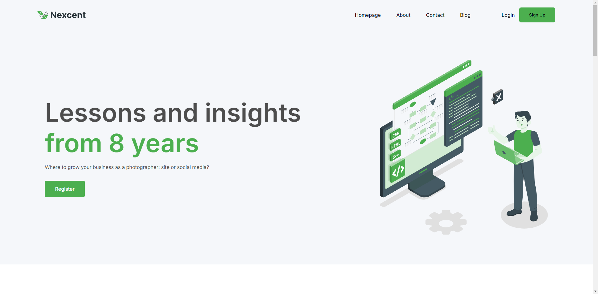

<!-- Improved compatibility of back to top link: See: https://github.com/othneildrew/Best-README-Template/pull/73 -->

<!-- PROJECT LOGO -->
 

  

  <h3 align="center">Responsive E-Commerce Project</h3>

  

    A responsive E-Commerce project built with Next.js (React + MongoDB).
     
     
    <a href="https://agency-nextjs-fullstack.vercel.app/">View Demo</a>
  

<!-- TABLE OF CONTENTS -->

  
Table of Contents

  <ol>
    <li>
      <a href="#about-the-project">About The Project</a>
      <ul>
        <li><a href="#built-with">Built With</a></li>
      </ul>
    </li>
    <li><a href="#usage">Usage</a></li>
    <li><a href="#license">License</a></li>
    <li><a href="#contact">Contact</a></li>
    <li><a href="#acknowledgments">Acknowledgments</a></li>
  </ol>

<!-- ABOUT THE PROJECT -->

## About The Project

This project was created to demonstrate my skills with React and Next.js. The application is fully responsive, providing an optimized experience on both mobile and desktop devices. It also includes backend support for database interactions using MongoDB.

(<a href="#readme-top">back to top</a>)

### Built With

- [![Next][Next.js]][Next-url]
- [![React][React.js]][React-url]
- 
- 
- 
- 
- 

(<a href="#readme-top">back to top</a>)

<!-- USAGE EXAMPLES -->

## Features

- Implemented a responsive NextJS application with the latest App Router, utilizing modular folder structure dedicated error pages, and engaging design made from figma.
- Integrated NextAuth for secure authentication, with role-based routing via NextJS middleware, enabling advanced access control for admins and users.
- Built server actions and API routes with Mongoose and MongoDB for efficient data encryption, CRUD operations, and user management.

(<a href="#readme-top">back to top</a>)

<!-- LICENSE -->

## Attributes

<a href="https://storyset.com/internet">Internet illustrations by Storyset</a>

(<a href="#readme-top">back to top</a>)

<!-- CONTACT -->

## Contact

Rajath Rao - raorajath1998@gmail.com

Project Link: [https://github.com/RajathRao2000/agency-nextjs-fullstack](https://github.com/RajathRao2000/agency-nextjs-fullstack)

(<a href="#readme-top">back to top</a>)

[Next.js]: https://img.shields.io/badge/next.js-000000?style=for-the-badge&logo=nextdotjs&logoColor=white
[Next-url]: https://nextjs.org/
[React.js]: https://img.shields.io/badge/React-20232A?style=for-the-badge&logo=react&logoColor=61DAFB
[React-url]: https://reactjs.org/
